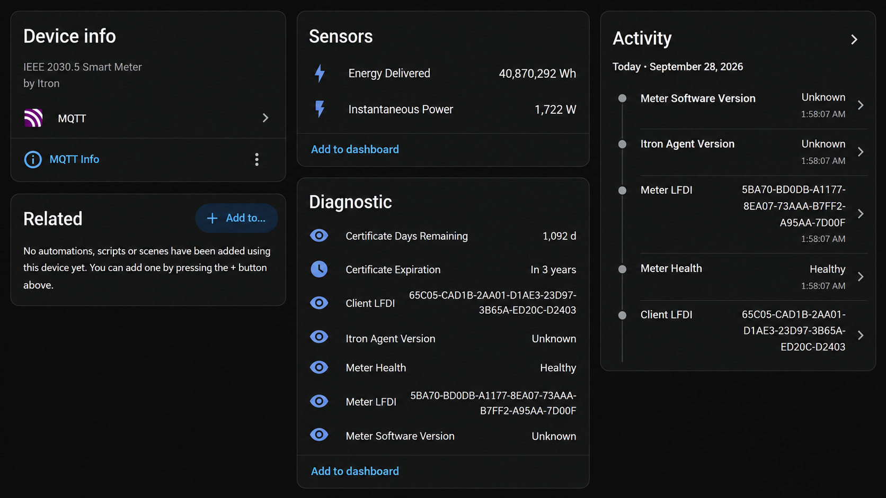
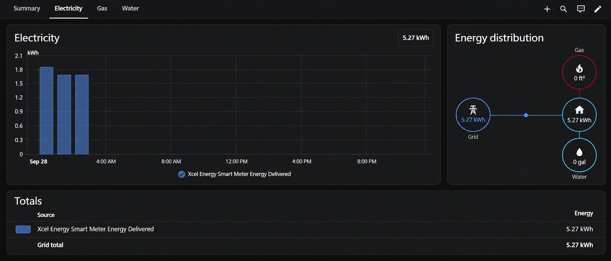
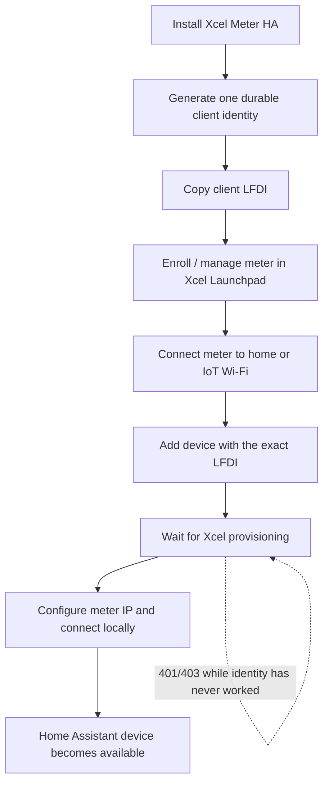
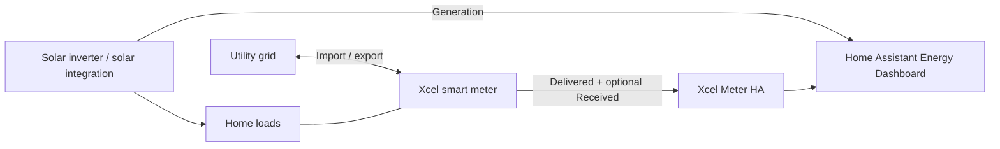

# Xcel Meter HA

Local-first Xcel Energy / Itron IEEE 2030.5 smart-meter data for Home Assistant.

Xcel Meter HA connects directly to a Launchpad-enabled meter on your local network, discovers the readings the meter actually exposes, validates the source data, and publishes one clean MQTT device into Home Assistant. Normal meter reads do not depend on a cloud polling service.

> **Project status:** `0.4.5b3` is the release-hardening candidate for native onboarding. Production meter communication, identity migration, freshness handling, and MQTT outage recovery have been validated on real hardware. New-identity onboarding and Itron Agent v1/v3 compatibility have also been exercised against Xcel's secure SDK meter simulator.

[](https://my.home-assistant.io/redirect/supervisor_add_addon_repository/?repository_url=https%3A%2F%2Fgithub.com%2Fsud0-odus%2Fxcel-meter-ha)

## What you get

- Local IEEE 2030.5 reads from the meter over TLS 1.2.
- A durable P-256 client identity and Launchpad LFDI generated once and then reused.
- Safe migration from the older `xcel-itron-mqtt` Home Assistant add-on identity.
- Dynamic UsagePoint and MeterReading discovery instead of hard-coded firmware paths.
- Instantaneous demand and cumulative energy delivered; cumulative energy received/export is optional.
- Source-timestamp freshness protection that never invents `0 W` when data is stale.
- Home Assistant MQTT discovery, availability, meter health, and identity diagnostics.
- Separate meter and MQTT failure domains so a broker outage is not reported as a meter failure.
- SDK-aligned paging and Itron v1/v2-compatible and v3 ReadingType classification.

### What it looks like in Home Assistant

Xcel Meter HA publishes one Home Assistant device with current power, cumulative energy, health, and identity diagnostics.



The cumulative delivered-energy sensor can be used as a grid-import source in Home Assistant's Energy dashboard.



## Start here

| You are... | Read this first |
|---|---|
| Installing for the first time | [`docs/GETTING_STARTED.md`](docs/GETTING_STARTED.md) |
| Migrating from the older add-on | [`xcel-meter-diagnostic/DOCS.md`](xcel-meter-diagnostic/DOCS.md#existing-user-migration) |
| Troubleshooting | [`docs/TROUBLESHOOTING.md`](docs/TROUBLESHOOTING.md) and [`docs/SUPPORT.md`](docs/SUPPORT.md) |
| Adding or using TOU/rate profiles | [`docs/TOU_AND_RATE_PROFILES.md`](docs/TOU_AND_RATE_PROFILES.md), [`rate_profiles/README.md`](rate_profiles/README.md), and the [opt-in HA package generator guide](examples/home-assistant/README.md) |
| Reviewing architecture/data flow | [`docs/ARCHITECTURE.md`](docs/ARCHITECTURE.md) |
| Testing with the Xcel SDK simulator | [`docs/TESTING_WITH_XCEL_SDK_SIMULATOR.md`](docs/TESTING_WITH_XCEL_SDK_SIMULATOR.md) |
| Reviewing compatibility/evidence | [`docs/VALIDATION_0.4.5.md`](docs/VALIDATION_0.4.5.md) and [`docs/COMPATIBILITY.md`](docs/COMPATIBILITY.md) |
| Contributing documentation | [`docs/DOCUMENTATION_GUIDE.md`](docs/DOCUMENTATION_GUIDE.md) |

## How the data moves


The app talks to the meter; Home Assistant does not need to poll Xcel's cloud for normal readings.

## New installation in five stages

1. **Add and install Xcel Meter HA** using the button above or add `https://github.com/sud0-odus/xcel-meter-ha` as a Home Assistant app/add-on repository.
2. **Start once to create the identity.** With `identity_source: auto` and `generate_identity_if_missing: true`, the app generates one IEEE 2030.5 client identity and prints its LFDI. Keep it. Do not regenerate it while waiting for Xcel.
3. **Enroll the meter in Xcel Energy Launchpad, connect the meter to Wi-Fi, and add the generated LFDI as a device.** See the detailed walkthrough in [`docs/GETTING_STARTED.md`](docs/GETTING_STARTED.md#2-enroll-the-meter-in-xcel-energy-launchpad).
4. **Wait for provisioning.** Xcel's portal and meter configuration changes are asynchronous. Community experience has ranged from hours for Wi-Fi changes to multiple days for device authorization. Xcel Meter HA intentionally reuses the same identity while you wait.
5. **Configure the meter IP and verify a successful local read.** Once provisioned, the log should show a matching LFDI, TLS/IEEE 2030.5 PASS, discovered readings, and healthy MQTT publication.



## Identity safety is a design requirement

A Launchpad client certificate is not disposable configuration. Its certificate-derived LFDI is the identity Xcel authorizes.

`identity_source: auto` follows this order:

1. Reuse an existing app-owned identity.
2. If configured, safely migrate a valid legacy identity into app-owned `/config/certs` and verify that the LFDI did not change.
3. Only when no usable identity exists, generate one app-owned identity once.

The app refuses to overwrite a partial/conflicting identity and does not regenerate because the meter, Wi-Fi, MQTT broker, Home Assistant, or Launchpad provisioning is temporarily unavailable.

App-owned files are:

- `/config/certs/cert.pem`
- `/config/certs/key.pem`
- `/config/certs/identity.json` - non-secret identity/provisioning status

Never publish or attach `key.pem` to an issue.

## What the meter data means

By default Xcel Meter HA exposes the meter readings most useful to Home Assistant:

- **Instantaneous Power** - current net demand reported by the meter.
- **Energy Delivered** - cumulative energy delivered from the grid to the premises.
- **Energy Received** - optional cumulative energy sent from the premises toward the grid when export monitoring is enabled and the meter exposes it.

For homes with solar, the utility meter normally represents the **grid boundary**, not total solar production. Use the inverter/solar integration for generation and Xcel Meter HA for grid import/export.



This avoids treating net meter demand as if it were solar production.

## Home Assistant options

Typical settings after onboarding:

```yaml
meter_ip: 192.168.1.50
meter_port: 8081
expected_lfdi: YOUR_LAUNCHPAD_CLIENT_LFDI
identity_source: auto
migrate_legacy_identity: true
generate_identity_if_missing: true
legacy_addon_slug: ""
timeout: 8
poll_interval: 60
log_level: INFO
mqtt_enabled: true
energy_export_enabled: false
```

`meter_ip` should normally be made stable with a DHCP reservation. An IoT VLAN/SSID is optional and often desirable, but Home Assistant must be allowed to reach the meter on TCP port 8081.

## Evidence, not assumptions

The project keeps production-hardware observations, SDK/simulator results, and automated tests separate. See [`docs/VALIDATION_0.4.5.md`](docs/VALIDATION_0.4.5.md).

Highlights already validated include:

- real production-meter mutual TLS and live reads;
- migration to app-owned identity followed by removal of the legacy add-on;
- real meter/Wi-Fi failure and recovery without discarding the cached profile;
- real Mosquitto outage/recovery while meter health remained independent;
- secure Xcel SDK simulator rejection of an unregistered LFDI and acceptance of the same identity after ACL registration;
- secure Agent v1 and v3 discovery/read;
- live multi-page MeterReading discovery;
- generated-identity provisioning state transitions;
- server certificate-derived LFDI matching `/sdev/sdi` in the SDK simulator;
- v3 interval resources being advertised while their ReadingList can legitimately contain zero readings.

## Related projects and prior art

This project learned from the Xcel/Itron community rather than treating earlier work as disposable. The review is recorded in [`docs/upstream-issue-review.md`](docs/upstream-issue-review.md).

In particular:

- `zaknye/xcel_itron2mqtt` established a useful Python/MQTT foundation and durable certificate/LFDI workflow.
- `wingrunr21/hassio-xcel-itron-mqtt` demonstrated a straightforward Home Assistant add-on installation experience and surfaced important timeout, outage, and firmware-compatibility reports.
- `ErikElkins/xcel-ha-monitoring` documented an approachable Launchpad/Home Assistant setup flow.
- `brianthedavis/xcel-prometheus-monitor` showed a useful separation between meter acquisition and downstream analytics/visualization.
- `tvories/hass_xcel_itron` reinforced the value of a minimal Home Assistant-first install experience, although its custom-integration architecture is different from this project's app/MQTT model.

We borrow ideas where they align, but protocol behavior is revalidated against the production meter, Xcel SDK, simulator, or tests before becoming a project assumption.

## Development

```bash
python3 -m venv .venv
source .venv/bin/activate
pip install -e '.[dev]'
pytest -q
```

CI tests Python 3.12, 3.13, and 3.14 and verifies root/add-on source parity plus package/app version parity.

## Security and support rules

- Never commit, post, or log a private key.
- Never delete/regenerate a provisioned identity as a generic troubleshooting step.
- Persist identity before registering its LFDI with Launchpad.
- Treat post-success HTTP 401/403 as an authorization problem, not as indefinite first-time provisioning.
- Never convert stale/missing current-power data to a fake `0 W`.
- Keep meter health separate from MQTT/Home Assistant transport health.
- Keep meter interactions read-only.
- Treat certificate renewal and physical meter replacement as explicit lifecycle events until Xcel documents otherwise.
- Keep utility rate logic separate from meter acquisition; community rate profiles are advisory and source-linked.
- Use the structured support/rate-profile issue forms so public reports arrive with useful evidence and redaction.

## Current direction

After native onboarding is finalized, planned work includes meter-replacement/counter-reset safeguards, optional mDNS discovery if Xcel confirms the production contract, additional sanitized fixtures, optional advanced diagnostics, and interval history only after its support and semantics are demonstrated. Time-of-use work starts as a provider-neutral, community-maintained rate-profile catalog plus Home Assistant helper guidance; native billing/rate logic is intentionally deferred until that model is proven across service regions.
