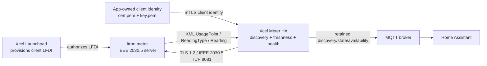
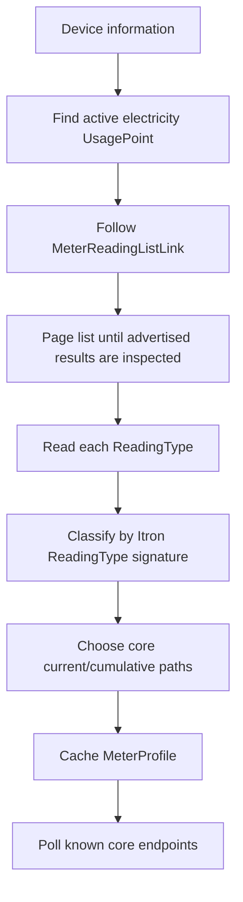
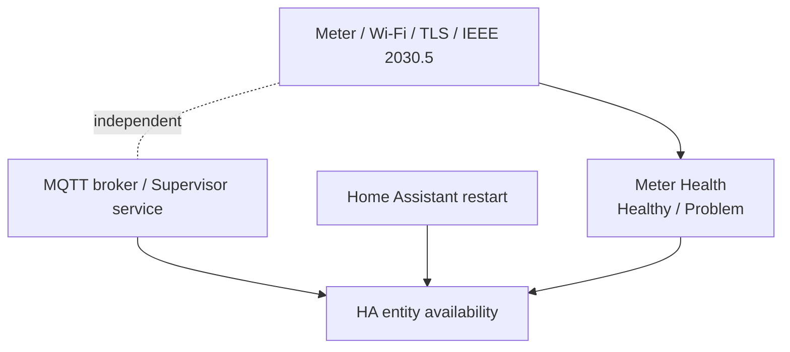
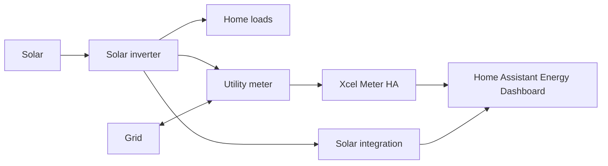

# Architecture and Data Flow

Xcel Meter HA is deliberately split into four concerns: utility onboarding/identity, local meter transport, measurement interpretation, and Home Assistant publication. Keeping those boundaries explicit makes failures easier to diagnose and prevents downstream outages from changing the meaning of meter health.

## Normal runtime path

The current production meter requires TLS 1.2 with `ECDHE-ECDSA-AES128-CCM8`. Xcel Meter HA opens conservative request connections rather than assuming a generic modern HTTPS stack will interoperate with the meter.

## Identity lifecycle

```mermaid
stateDiagram-v2
    [*] --> ExistingIdentity: app-owned identity exists
    [*] --> LegacyMigration: valid legacy identity exists
    [*] --> GenerateOnce: no usable identity exists

    LegacyMigration --> ExistingIdentity: copy + verify same LFDI
    GenerateOnce --> Pending: persist identity + display LFDI
    Pending --> Pending: not yet provisioned; keep same identity
    Pending --> Active: first successful meter authentication
    Active --> Active: restart / normal polling
    Active --> AuthorizationError: later 401/403

    ExistingIdentity --> Active: meter accepts identity
```

The key invariant is that transport failure does **not** cause identity regeneration.

## Meter discovery

The app does not select endpoints based only on a guessed firmware version.

A cached profile is retained across ordinary transport failures. HTTP `404`/`410` or other evidence that a discovered resource no longer exists can invalidate it and trigger rediscovery.

## Freshness and truthfulness

A successful HTTP request only proves that communication occurred now; it does not prove that a measurement was produced now.

When a meter provides `timePeriod.start` and `duration`, freshness uses the **end of the measurement interval**. Stale current-power data is not published as current and is never silently replaced with `0 W`. Meters that omit timestamp metadata remain supported; the app reports freshness as unavailable instead of inventing a timestamp.

## Failure domains

Examples:

- Meter unreachable: meter health can become `Problem`; MQTT may still be connected.
- MQTT unavailable: HA entities can become unavailable while the app continues to poll a healthy meter.
- Home Assistant/app restart: entities can temporarily be unavailable without publishing a false meter-side problem.

## Grid import/export and solar

The meter sits at the utility boundary. It can report cumulative energy delivered to the premises and, where enabled/supported, cumulative energy received from the premises. That is not the same thing as measuring total solar production.

For a solar home:

- inverter integration: production;
- meter Energy Delivered: grid import;
- meter Energy Received: grid export, when available/enabled.

## Server identity observation

In the secure Xcel SDK simulator, the SHA-256-derived LFDI of the TLS server certificate matched the meter LFDI returned by `/sdev/sdi`. That is valuable protocol evidence, but Xcel Meter HA does not currently pin/enforce that relationship on production meters because meter replacement and certificate-rotation expectations are not yet documented well enough.

See [`SDK_ALIGNMENT_0.4.5.md`](SDK_ALIGNMENT_0.4.5.md) and [`VALIDATION_0.4.5.md`](VALIDATION_0.4.5.md) for the evidence and open questions.
