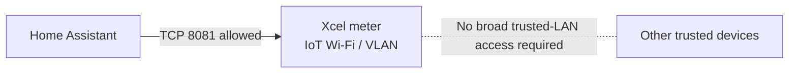
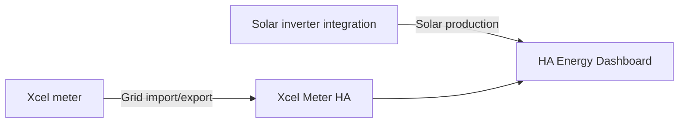

# Getting Started

This guide is for a new Xcel Meter HA installation. It intentionally separates the Home Assistant install, Xcel Launchpad enrollment, local network setup, and final meter validation so that a delay in one layer does not look like a failure in another.

## Before you start

You need:

- a compatible Xcel Energy smart meter with Launchpad access available on your account;
- Home Assistant with Apps/Add-ons support;
- an MQTT broker available to Home Assistant (the Mosquitto app/add-on is the common choice);
- Wi-Fi coverage at the meter;
- a network path from the Home Assistant host to the meter on TCP port `8081`.

An IoT VLAN or separate SSID is optional, not required. If you use one, permit Home Assistant to initiate traffic to the meter on TCP `8081` while keeping the meter isolated from unrelated trusted devices.

## 1. Install Xcel Meter HA

Use the My Home Assistant link:

[](https://my.home-assistant.io/redirect/supervisor_add_addon_repository/?repository_url=https%3A%2F%2Fgithub.com%2Fsud0-odus%2Fxcel-meter-ha)

Or add this repository manually in Home Assistant:

```text
https://github.com/sud0-odus/xcel-meter-ha
```

Install **Xcel Meter HA** from the repository.

For a fresh installation, these identity settings are intentionally safe defaults:

```yaml
identity_source: auto
migrate_legacy_identity: true
generate_identity_if_missing: true
```

`meter_ip` may be left empty for the first run. Start Xcel Meter HA and open its log.

The app creates one app-owned P-256 IEEE 2030.5 identity and prints a message containing the client LFDI. The formatted log may contain hyphens for readability; the underlying LFDI is 40 hexadecimal characters.

**Keep this identity. Do not generate another one just because Xcel provisioning is not complete yet.**

## 2. Enroll the meter in Xcel Energy Launchpad

Open Xcel's **Meters and Devices** page:

https://my.xcelenergy.com/MyAccount/s/meters-and-devices/manage-meters-and-devices

The exact wording in Xcel's portal can change, but the current community flow is:

1. Enroll the eligible smart meter in **Xcel Energy Launchpad**.
2. When enrollment is available, choose **Manage** for the meter.
3. Use **Edit** to configure the meter's Wi-Fi if it is not already connected.
4. Wait for the portal/router to show that the meter has joined the network.
5. Create a DHCP reservation for the meter so its IP address stays stable.
6. In Launchpad, choose **Add a Device**.
7. Paste the **exact LFDI generated by Xcel Meter HA**.
8. Use descriptive values for nickname/manufacturer/device type if the portal asks for them. The LFDI is the security identity that must match exactly.
9. Submit the device and keep the same Xcel Meter HA certificate/key while Xcel provisions it.

### Wi-Fi notes

Meter Wi-Fi changes are asynchronous and may take time to appear. A separate IoT VLAN/SSID can be a good security boundary when your network supports it. It is not useful, however, if firewall rules prevent Home Assistant from reaching the meter's local IEEE 2030.5 service.

A practical network layout is:



### Provisioning time

Do not use a fixed countdown as a health test. Community projects have reported that Wi-Fi enrollment can take hours and Launchpad device authorization can take multiple days, sometimes around a week. Xcel Meter HA therefore distinguishes a never-authenticated generated identity from an identity that has worked before.

For a newly generated identity that has never authenticated, an explicit TLS client-auth rejection or HTTP `401`/`403` can be reported as **onboarding/provisioning pending**. The app keeps the same identity and retries. Once that identity has authenticated successfully, a later `401`/`403` is treated as an authorization error instead of pretending the first-time provisioning wait restarted.

## 3. Configure the meter address

Once the meter is visible on your network, set the app options. A typical configuration is:

```yaml
meter_ip: 192.168.1.50
meter_port: 8081
expected_lfdi: YOUR_GENERATED_LFDI
identity_source: auto
migrate_legacy_identity: true
generate_identity_if_missing: true
legacy_addon_slug: ""
timeout: 8
poll_interval: 60
log_level: INFO
mqtt_enabled: true
energy_export_enabled: false
```

Use your meter's actual IP address. `expected_lfdi` is the **client/device LFDI that you registered with Xcel**, not the meter/server LFDI that the app later reads from `/sdev/sdi`.

Restart Xcel Meter HA after saving the configuration.

## 4. Know what success looks like

A healthy startup should show the same general sequence:

```text
Identity source: own
Certificate-derived LFDI: ...
Expected/Launchpad LFDI: ...
LFDI validation: MATCH
MeterReading discovery: ...
TLS/IEEE 2030.5 connection: PASS
Connection health: HEALTHY
RESULT: PASS
MQTT state published: ...
```

The app may report Itron agent/software version as `unknown` if the meter does not expose authoritative version data. That is intentional; it does not guess a firmware generation.

If the LFDI matches but the new identity is still reported as provisioning pending, keep the identity and see [`TROUBLESHOOTING.md`](TROUBLESHOOTING.md#new-install-is-still-onboarding--provisioning-pending).

## 5. Add the readings to Home Assistant

With MQTT enabled and the broker available, Xcel Meter HA publishes one MQTT device with measurements and diagnostics.

Typical measurements are:

- Instantaneous Power;
- Energy Delivered;
- Energy Received when `energy_export_enabled: true` and the meter exposes the reading.

For Home Assistant's Energy dashboard, cumulative **Energy Delivered** is the normal grid-import source. If you have solar, use your inverter/solar integration for production and the meter's received/export energy for grid export when supported.



## Existing users of the older add-on

Do not follow the fresh-identity path if you already have a Launchpad-provisioned certificate unless you deliberately want a new Launchpad identity.

Xcel Meter HA can migrate the existing identity into app-owned storage while preserving its LFDI. Follow [`../xcel-meter-diagnostic/DOCS.md`](../xcel-meter-diagnostic/DOCS.md#existing-user-migration) before removing the old add-on.

## Screenshots

We intentionally do not copy portal screenshots from older community repositories because Xcel's UI changes and image licensing/identifying account data may be unclear. The project keeps a capture checklist in [`images/README.md`](images/README.md) so screenshots can be added from the current Xcel and Home Assistant interfaces with personal information redacted.
