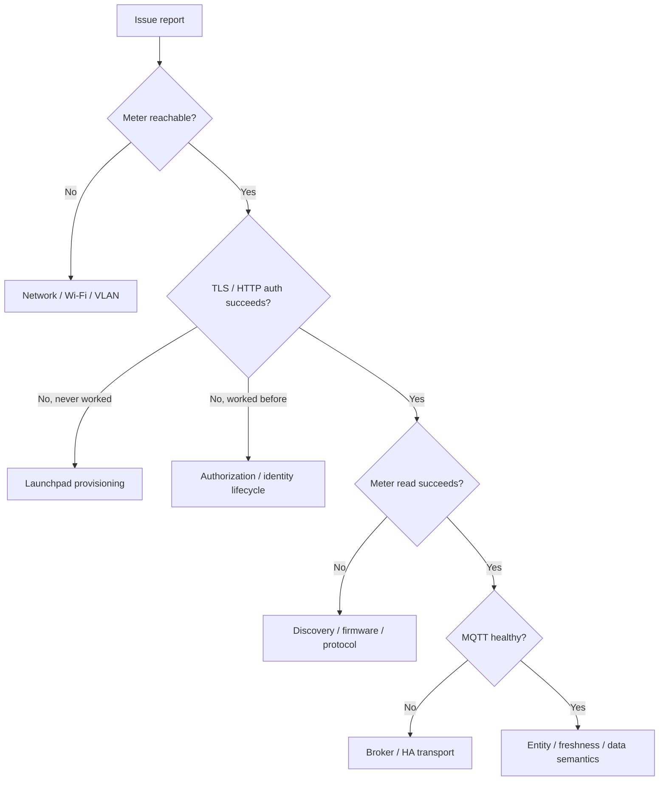

# Support and Issue Reporting

Good issue reports let us separate meter, Launchpad authorization, local network, MQTT, Home Assistant, and rate-profile problems without asking users to expose private account data.

Use the repository's GitHub issue forms when possible:

- **Support / bug report** for installation, identity, meter, MQTT, Home Assistant, or regression problems.
- **Rate profile submission** for a new state/service region/rate plan or a correction to an existing profile.

## Before opening a support issue

Check [`TROUBLESHOOTING.md`](TROUBLESHOOTING.md) first. In particular, do not delete or regenerate a provisioned certificate as a generic troubleshooting step.

Collect these basics:

- Xcel Meter HA version;
- Home Assistant version and installation type;
- whether this is a fresh generated identity or a migrated identity;
- whether this exact client identity has ever authenticated successfully;
- whether the meter is reachable on TCP port `8081` from the Home Assistant host/network;
- whether MQTT is healthy;
- meter/agent version only if Xcel Meter HA reports it authoritatively;
- the smallest useful block of log lines before, during, and after the failure.

If the issue appeared after an upgrade, include the last version that worked.

## Logs that are useful

From the Xcel Meter HA app/add-on log, include the lines around the failure that show:

- app version/startup;
- identity origin/state, with LFDIs redacted in public reports;
- connection stage or HTTP status;
- discovery/profile-cache decisions if relevant;
- sample freshness details if the problem concerns Instantaneous Power;
- MQTT connect/publish/recovery messages if the problem concerns Home Assistant entities.

A 20-60 line window around the first failure is usually more useful than thousands of repeated retry lines.

For a reproducible meter-side problem, the command-line diagnostic can also be useful when you already have a safe copy of the same identity:

```text
xcel-meter probe --host METER_IP --dir ./certs --expected-lfdi YOUR_EXPECTED_LFDI
xcel-meter read --host METER_IP --dir ./certs --expected-lfdi YOUR_EXPECTED_LFDI --pretty
```

Do not create a new identity just to run diagnostics against a provisioned meter. Redact the LFDI and any unnecessary IP/address information from the output before posting it publicly.

## Always redact before posting publicly

Remove or replace:

- private keys (`key.pem`) - never attach or paste this file;
- Xcel account numbers;
- customer names and addresses;
- Wi-Fi SSIDs/passwords when not essential;
- public IP addresses;
- meter/client LFDIs unless a maintainer specifically needs one for a narrow comparison;
- certificate serial numbers if unnecessary;
- unrelated MQTT credentials/tokens;
- router/controller screenshots containing other household/device information.

`cert.pem` is not the private key, but a public issue rarely needs the full certificate either.

## Files that may be safe after review

`/config/certs/identity.json` is intentionally non-secret diagnostic state, but review it before posting because it can still contain installation identifiers or timestamps that you may prefer to redact.

Screenshots should follow [`DOCUMENTATION_GUIDE.md`](DOCUMENTATION_GUIDE.md#screenshot-policy).

## A useful issue tells us the failure domain

Try to answer these questions in the report:

| Question | Why it matters |
|---|---|
| Does TCP `8081` respond? | Separates basic network reachability from TLS/application errors. |
| Is the exact client identity registered with Launchpad? | Separates provisioning from transport. |
| Has this identity ever worked before? | Distinguishes first-time onboarding from a later authorization regression. |
| Do meter reads continue while MQTT fails? | Separates meter health from broker/Home Assistant health. |
| Is only Instantaneous Power stale? | Points toward source timestamps/freshness rather than total meter failure. |
| Did the problem begin after a version change? | Helps isolate regressions. |

## Rate-profile submissions

For rate-plan contributions, do not upload an unredacted utility bill. Prefer an official public tariff/rate-book URL. If your only evidence is a customer portal or bill, provide the rate facts after removing account number, name, address, meter number, and other unique identifiers.

Include:

- country/state and Xcel service region;
- operating company if known;
- rate plan name and rate code if shown;
- timezone;
- effective date or the date you verified it;
- season definitions;
- peak/mid-peak/off-peak time windows;
- weekday/weekend/holiday rules;
- rate per kWh for each period and season;
- whether the values are base energy charges or an all-in estimate;
- a public source URL when available.

See [`../rate_profiles/README.md`](../rate_profiles/README.md) for the catalog rules.

## Maintainer triage path

A simple issue can usually be classified into one of these buckets:



This is intentionally lightweight. The goal is to ask for the right evidence once, not create a ticketing bureaucracy.
