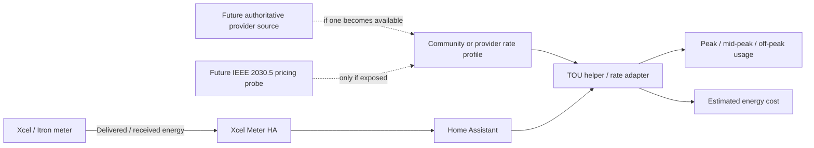

# Time-of-Use Rates and Community Rate Profiles

Xcel Meter HA should keep meter acquisition separate from utility pricing. The meter tells us how much energy crossed the grid boundary. A tariff tells us what that energy may cost and when different rates apply.

This page records the current design direction for time-of-use (TOU) support and the community-maintained rate-profile catalog.

## Current recommendation

For now, keep the core Xcel Meter HA runtime rate-agnostic and use Home Assistant's built-in Utility Meter helper for tariff buckets.

Home Assistant already supports:

- a cumulative source sensor such as Xcel Meter HA **Energy Delivered**;
- multiple tariff buckets such as `on_peak`, `mid_peak`, and `off_peak`;
- a select entity that represents the active tariff;
- automations that change the active tariff based on time or another source;
- helper and template entities for user-editable rates and estimated cost.

See:

- [Home Assistant Utility Meter](https://www.home-assistant.io/integrations/utility_meter/)
- [Home Assistant electricity grid and tariffs](https://www.home-assistant.io/docs/energy/electricity-grid/)
- [Home Assistant Number helper](https://www.home-assistant.io/integrations/input_number/)

This gives us a useful user workflow now without mixing billing logic into the IEEE 2030.5 meter client.

## Why TOU is not just another add-on toggle

The existing export option changes which meter reading Xcel Meter HA publishes. TOU is different: it is policy layered on top of the same energy measurements.

A rate plan can vary by:

- state and Xcel operating company;
- rate code or pilot program;
- season;
- weekday, weekend, and provider-defined holidays;
- time of day;
- import versus export direction;
- fixed customer charges, riders, fuel adjustments, credits, and taxes;
- effective date.

Xcel also publishes adjustments that can change independently of a base energy rate. For example, Minnesota fuel and rider values are published separately and can change over time. A simple dollars-per-kWh profile therefore should be treated as an **energy-cost estimate**, not a reproduction of the final bill.

Useful public references include:

- [Xcel Energy rate books](https://www.xcelenergy.com/company/rates_and_regulations/rates/rate_books)
- [Xcel Energy rate riders](https://www.xcelenergy.com/company/rates_and_regulations/rates/rate_riders)
- [Xcel Energy Minnesota Flex Pricing Pilot](https://www.xcelenergy.com/company/rates_and_regulations/filings/flex_pricing_pilot)

## What Xcel already demonstrates

Xcel's own My Energy Connection materials combine meter usage with current-rate/TOU context and estimated energy cost. Xcel also labels those displayed values as estimates rather than final billing data. That is a useful product model for this project: show actionable rate context while keeping a clear boundary between an estimate and the utility bill.

See Xcel's [My Energy Connection program material](https://www.xcelenergy.com/staticfiles/xe-responsive/Company/Rates%20%26%20Regulations/22A-0315EG%20Q2%202023%20DSM%20Roundtable%20PPT.pdf) and the public [Integrated Distribution Plan appendix showing current rate/TOU presentment](https://prod2.xcelenergy.com/staticfiles/xe-responsive/Company/Rates%20%26%20Regulations/Regulatory%20Filings/202311-200135-01.pdf).

Those materials do not establish where the tariff metadata comes from. It may be account/cloud context rather than an IEEE 2030.5 resource exposed by the meter. Xcel Meter HA should keep that distinction explicit.

## What the IEEE 2030.5 standard can represent

IEEE 2030.5 includes a pricing function set with concepts such as `TariffProfile`, `RateComponent`, `TimeTariffInterval`, and `ConsumptionTariffInterval`. Those resources can model time-differentiated pricing.

That does **not** prove that Xcel's production meter agent exposes those resources to Launchpad clients.

The Xcel SDK meter-simulator source reviewed for the 0.4.5 work is metering-focused. Its `DeviceCapability` model and simulator route expose the UsagePoint/metering path, and the reviewed source does not implement the tariff/pricing resources above. Therefore Xcel Meter HA should not assume that a production meter provides an authoritative rate plan until that is demonstrated separately.

Future protocol research can safely probe for pricing links as a read-only diagnostic. Absence must remain a normal result, not an error.

## Community rate profiles

The repository now has a [`rate_profiles/`](../rate_profiles/README.md) catalog. Profiles are intended to be:

- human-readable examples;
- source-linked;
- dated;
- explicit about service region and rate code;
- clear about whether the values are historical, community-submitted, or verified against an official public source.

They are **not** currently loaded by the add-on at runtime.

A rate profile is useful even before native TOU support exists because it gives users a common description that can be translated into Home Assistant helpers and automations.

## Home Assistant package generator

Phase 2 now includes [`tools/generate_ha_tou_package.py`](../tools/generate_ha_tou_package.py). It converts a validated repository rate profile into an opt-in Home Assistant package while leaving the Xcel Meter HA add-on itself rate-agnostic.

Find the actual Home Assistant entity ID for Xcel Meter HA **Energy Delivered**, then generate a package:

```bash
python tools/generate_ha_tou_package.py \
  rate_profiles/profiles/us-mn-xcel-a72-a74-2022.toml \
  --source-entity sensor.your_energy_delivered_entity \
  --output xcel_tou.yaml
```

The generated package contains:

- a Home Assistant Utility Meter with tariff buckets matching the profile period names;
- **Xcel TOU Current Period**;
- **Xcel TOU Current Season**;
- **Xcel TOU Current Rate** in `USD/kWh`;
- an automation that synchronizes the Utility Meter tariff select entity to the computed period;
- a persistent provider-holiday date helper when the profile excludes provider-defined holidays.

Home Assistant's Utility Meter integration creates a tariff selector when tariffs are configured; automations can change that selector with `select.select_option`. The generated package uses that native mechanism rather than implementing a second energy accumulator in this project.

The package evaluates times using Home Assistant's configured local timezone. Confirm that Home Assistant's timezone matches the profile `timezone` before relying on the schedule.

### Holiday handling is deliberately conservative

The schema currently stores provider holiday rules as human-readable evidence. It does not yet define a machine-readable holiday calendar. If any period sets `exclude_holidays = true`, the generated package creates `input_datetime.xcel_tou_provider_holiday` (or the equivalent custom namespace). Set it to a provider-defined holiday date. The override applies only when that saved date equals today.

Choosing the date is intentionally manual for now. Automatically substituting a generic US holiday calendar could be wrong when a tariff uses provider-specific holidays or observance rules. A date helper is safer than a persistent on/off switch because yesterday's holiday selection stops matching automatically after midnight.

### Why the first package does not calculate a monthly bill

The generator exposes the **current configured energy rate** and accumulates usage into tariff buckets, but it intentionally stops short of a final monthly cost sensor. A naive `bucket kWh × current rate` calculation can become wrong when a billing period crosses a seasonal or rate-effective boundary. Fixed charges, riders, fuel adjustments, credits, demand charges, taxes, and other billing rules may also be outside the profile.

Use the generated data for automation, visibility, and rate-period analysis. Treat any later cost calculation as an estimate until the project models those boundaries explicitly.

See [`../examples/home-assistant/README.md`](../examples/home-assistant/README.md) for installation and a small HA-side validation checklist.

## Architecture direction



The meter path remains useful even if rate logic changes completely.

## Proposed phases

### Phase 1 - contribution and documentation foundation

Current scope:

- a versioned profile format;
- one historical, source-backed Xcel Minnesota example;
- a profile validator in CI;
- a GitHub rate-profile submission form;
- a structured support request form and support checklist;
- Home Assistant guidance using Utility Meter tariffs and helpers.

### Phase 2 - reusable Home Assistant recipe

Implemented as an opt-in package generator:

- tariff Utility Meter buckets;
- current period and season sensors;
- current configured energy-rate sensor;
- active-period automation using Home Assistant's tariff select entity;
- explicit provider-holiday date helper when required by the profile.

The first implementation deliberately defers billing-period cost totals until seasonal/rate-effective boundaries can be modeled without re-pricing historical energy at today's rate. Profiles remain user-editable TOML and can be regenerated without changing the meter runtime.

### Phase 3 - optional native rate adapter

Only after the model is proven across multiple service regions should Xcel Meter HA consider native rate entities such as:

- current tariff period;
- current configured energy rate;
- next tariff period and change time;
- estimated cost today/billing cycle;
- usage accumulated by tariff bucket.

If Xcel later provides an authoritative rate API or exposes IEEE 2030.5 pricing resources on production meters, that source can be added behind the same rate-profile abstraction rather than rewriting meter acquisition.

## What would change this design

The architecture should be revisited if any of these are demonstrated:

- a production Launchpad meter exposes a usable pricing function set;
- Xcel publishes an authenticated customer-rate API suitable for local integrations;
- Home Assistant gains a better provider-neutral tariff import format;
- submitted profiles reveal billing structures that the initial schema cannot represent cleanly.

Until then, rate profiles are intentionally advisory and Xcel Meter HA remains a read-only meter-data bridge.
