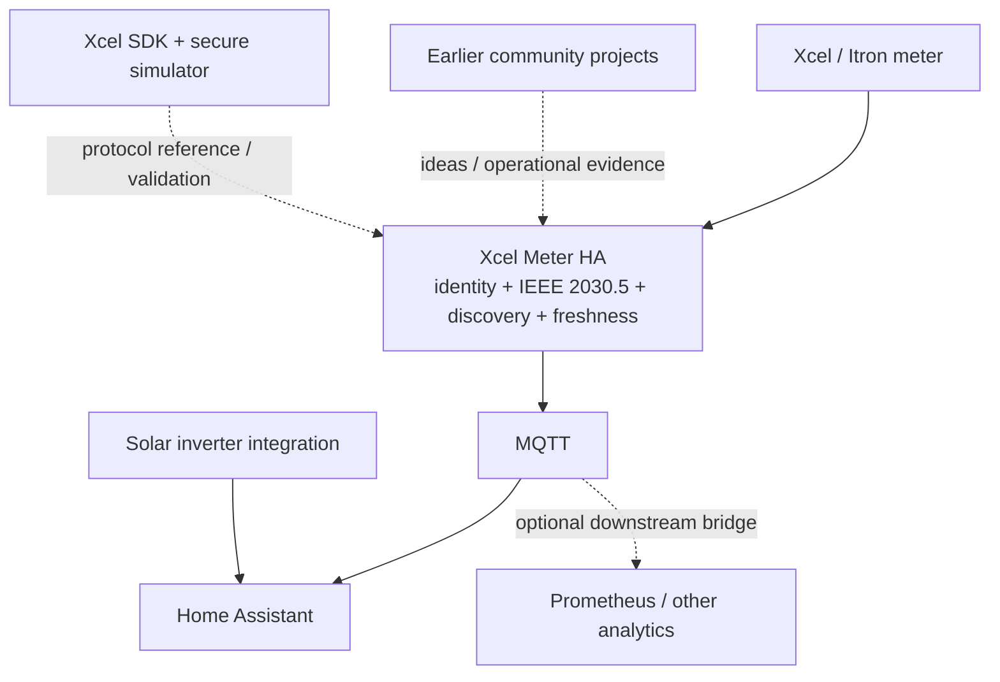

# Upstream Project and Issue Review

Last reviewed: 2026-09-28

This document records lessons from public Xcel/Itron community projects and checks their currently open issues against Xcel Meter HA. The goal is to reuse good ideas without inheriting assumptions that conflict with current production-meter evidence, Xcel's SDK, or this project's identity/data-integrity rules.

## Projects reviewed

| Project | What is useful here | Current open issues reviewed |
|---|---|---|
| [brianthedavis/xcel-prometheus-monitor](https://github.com/brianthedavis/xcel-prometheus-monitor) | Clear data-flow diagrams; separation of meter acquisition from Prometheus/Grafana analytics; Launchpad/network setup notes | 0 |
| [ErikElkins/xcel-ha-monitoring](https://github.com/ErikElkins/xcel-ha-monitoring) | User-oriented Launchpad walkthrough; Home Assistant Energy dashboard examples; visual setup style | 0 |
| [tvories/hass_xcel_itron](https://github.com/tvories/hass_xcel_itron) | Very simple Home Assistant-first installation concept | 0 |
| [zaknye/xcel_itron2mqtt](https://github.com/zaknye/xcel_itron2mqtt) | Durable certificate/LFDI workflow; Python/MQTT foundation; operational history | 1 - #47 |
| [wingrunr21/hassio-xcel-itron-mqtt](https://github.com/wingrunr21/hassio-xcel-itron-mqtt) | Home Assistant repository/install experience; Supervisor MQTT integration; operational issue history | 3 - #28, #39, #41 |

Xcel Meter HA does not simply wrap these projects. It contains its own identity lifecycle, IEEE 2030.5 transport/discovery/classification, freshness, caching, MQTT runtime, and Home Assistant behavior.

## What we intentionally borrow

### User experience

From the Home Assistant-oriented projects:

- one-click My Home Assistant repository-add link;
- a short installation path before deep technical details;
- Launchpad enrollment described as a distinct prerequisite;
- stable/DHCP-reserved meter IP guidance;
- Energy dashboard examples after basic meter communication works.

### Network/data-flow documentation

From `xcel-prometheus-monitor`:

- Mermaid-style diagrams showing each system boundary;
- keeping meter acquisition separate from optional downstream analytics;
- treating solar/inverter data as a separate source that can later be combined in a visualization layer.

### Durable identity

From `xcel_itron2mqtt` and the official SDK:

- generate once and reuse certificate/key;
- derive/display LFDI from the actual certificate;
- do not treat identity as disposable cache.

Xcel Meter HA extends this with app-owned migration, expected-LFDI checking, identity history, first-time provisioning state, and explicit regeneration protection.

## What we do not copy

- Old `curl | bash` certificate-generation instructions for end users. Xcel Meter HA now creates/persists the identity itself.
- Polling every five seconds as a default. Xcel Meter HA currently defaults to a more conservative 60-second poll interval based on production behavior and reliability goals.
- Firmware-number-only endpoint routing. Xcel Meter HA discovers resources and classifies ReadingTypes instead.
- Generic certificate deletion/regeneration as troubleshooting.
- A custom-integration/HACS architecture solely because another project uses it; this project currently uses a Home Assistant app/add-on plus MQTT so meter transport remains isolated and MQTT discovery works cleanly.
- Prometheus/Grafana as a required stack. They are valid optional consumers, not part of the meter transport core.

## Status terminology

| Status | Meaning |
|---|---|
| COVERED | Current implementation directly addresses the concern. |
| PARTIAL | Relevant protections exist, but more evidence/work remains. |
| INVESTIGATE | The report is useful but needs stronger protocol/real-meter evidence. |
| NOT ADOPTED | The suggested behavior conflicts with this project's design/evidence. |

## Open issue review

### zaknye/xcel_itron2mqtt #47 - Frequent `ReadTimeout` warnings during polling

Source: https://github.com/zaknye/xcel_itron2mqtt/issues/47

Status: **COVERED / CONTINUE TO OBSERVE**

The issue reports frequent read timeouts while data still flows, with occasional TLS `BAD_SIGNATURE` behavior under a five-second polling setup.

Relevant Xcel Meter HA protections:

- serialized polling;
- 60-second default poll interval;
- conservative retry handling for observed transient TLS failures;
- fresh TLS/request behavior compatible with the production meter;
- cached core-reading paths to avoid rediscovery load on every poll;
- transient transport failure does not invalidate the cached profile;
- only clear resource-layout signals such as HTTP `404`/`410` invalidate discovered paths;
- meter failure is kept separate from MQTT publication failure.

This issue remains worth watching because it confirms that intermittent meter response behavior is not unique to one installation. It does not justify increasing concurrency or regenerating identity.

### wingrunr21 #28 - Read timed out

Source: https://github.com/wingrunr21/hassio-xcel-itron-mqtt/issues/28

Status: **COVERED / CONTINUE TO OBSERVE**

Xcel Meter HA has independently observed transient TLS/transport failures and is designed around conservative retries, configurable timeout, serialized polling, and cached profiles. A timeout after a previously healthy connection is treated as a transport problem, not an identity-loss event.

Future diagnostics may expose failure/retry counters, but the core safety behavior is already present.

### wingrunr21 #39 - Showing Demand during Power Outage

Source: https://github.com/wingrunr21/hassio-xcel-itron-mqtt/issues/39

Status: **COVERED FOR STALENESS; REAL OUTAGE SEMANTICS STILL INVESTIGATE**

This upstream report was one of the reasons Xcel Meter HA added source-sample freshness protection.

Implemented/validated behavior:

- parse meter `timePeriod.start` and `duration` when present;
- calculate freshness from measurement interval end;
- reject stale current-power samples as current data;
- never fabricate `0 W` merely because communication/data is stale;
- preserve compatibility when timestamp metadata is absent;
- production meter provided real one-second timestamp metadata during validation.

What remains unknown is the exact measurement semantics of every meter/firmware during a real utility outage. The project therefore solves the stale-data problem without claiming that every non-zero outage reading is necessarily wrong.

### wingrunr21 #41 - Itron firmware 3.2.50

Source: https://github.com/wingrunr21/hassio-xcel-itron-mqtt/issues/41

Status: **COVERED BY DYNAMIC DISCOVERY + SDK/SIMULATOR; SPECIFIC FIELD FIRMWARE STILL UNVERIFIED**

Xcel Meter HA does not depend on a single firmware-number path map.

Current behavior:

- discover active electricity UsagePoint;
- page advertised MeterReading resources;
- inspect ReadingType signatures;
- classify SDK-aligned v1/v2-compatible and v3 readings;
- leave software/agent version `unknown` when the meter does not report it authoritatively.

The secure Xcel simulator has passed both Agent v1 and v3 discovery/read and live paging. That is stronger compatibility evidence than a hard-coded firmware switch, but it is not the same as physically testing every deployed firmware including 3.2.50.

## Previously relevant closed/operational concern

### wingrunr21 #36 - Supervisor MQTT service unavailable

Status: **COVERED**

Xcel Meter HA validates MQTT service information, separates MQTT from meter health, keeps meter polling alive when the broker is unavailable, and was production-tested through a Mosquitto stop/start cycle. Broker recovery succeeded without restarting the app.

## Architecture comparison



The design goal is not to be different for its own sake. It is to put each concern in the layer where it can be validated and supported safely.

## Review cadence

Before a release candidate or major compatibility change:

1. Recheck open issues in all five projects above.
2. Record any new issue that could change identity, TLS, discovery, freshness, MQTT, firmware compatibility, or onboarding behavior.
3. Prefer reproducing the concern in an automated fixture, secure SDK simulator, or real meter before changing core behavior.
4. Update this document with the evidence level and decision.

## Cross-project engineering lessons

### Polling and meter load

The earlier ecosystem shows why aggressive polling is not automatically better. The production meter used by Xcel Meter HA advertises many MeterReading resources, and full discovery is much heavier than polling a small cached core profile.

Current approach:

```text
startup / profile invalid
  -> discover UsagePoint
  -> page MeterReadings
  -> inspect ReadingTypes
  -> cache core paths

normal poll
  -> read cached core paths only
```

This reduces TLS handshakes, meter load, and the opportunity for transient failures while still permitting rediscovery when a resource genuinely disappears.

### Data provenance

Use this preference order throughout user-facing behavior:

1. meter-reported facts;
2. utility-provided facts;
3. locally observed/derived values.

Examples of meter facts are instantaneous demand and cumulative delivered/received energy. Examples of local observations are last successful poll, transport error, sample age, or MQTT availability. Tariff estimates, net calculations not directly supplied by the meter, and other analytics must be labeled as derived rather than presented as utility facts.

### Optional analytics are downstream

Prometheus, Grafana, tariff calculators, solar APIs, and other analytics can be valuable without becoming part of the IEEE 2030.5 transport core. Keeping the core output clean makes those integrations easier to add later and easier to remove without risking meter connectivity.

## Backlog influenced by upstream review

High-value follow-up work that remains compatible with current evidence:

- add more sanitized firmware/resource fixtures as real examples become available;
- expose carefully chosen retry/failure diagnostics without cluttering the default HA device;
- define meter-replacement and cumulative-counter-reset behavior;
- add optional mDNS discovery only if Xcel confirms the production contract;
- consider optional Prometheus/exporter documentation as a downstream integration, not a required service;
- add interval history only after non-empty samples and semantics are proven;
- keep tariffs/rates separate from the meter transport layer.

## Issues we should not solve by guessing

Do not change production behavior merely to satisfy an unverified hypothesis. In particular:

- do not force Instantaneous Demand to `0 W` during an outage;
- do not guess firmware when `softwareVersion` is missing;
- do not regenerate a certificate after TLS/authentication failure;
- do not treat every timeout as evidence that meter discovery is invalid;
- do not expose a reading based only on a description when ReadingType evidence disagrees;
- do not claim interval history because a ReadingSet link exists.
